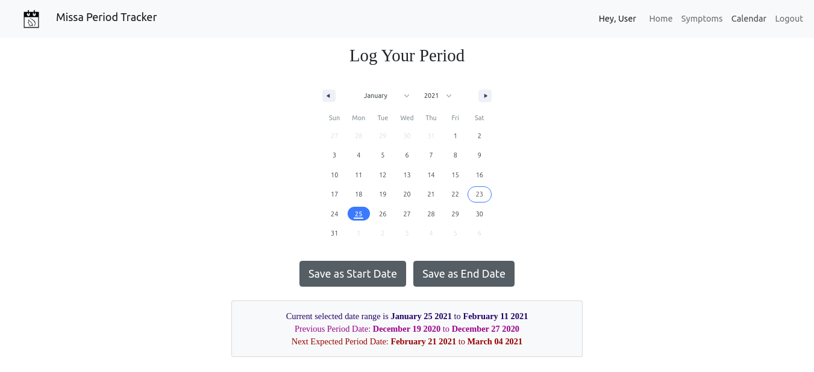
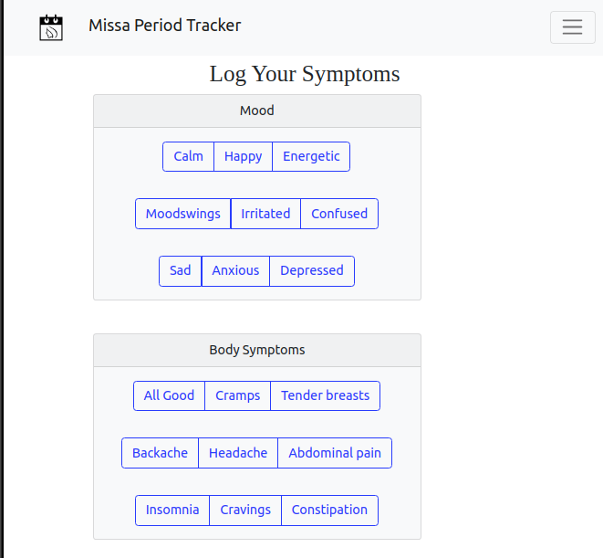

# Missa Period Tracker

## Table of Contents

* [About the Project](#about-the-project)
    * [Built with](#built-with)
* [Getting Started](#getting-started)
    * [Run the app](#run-the-app)    
    * [Available Scripts](#available-scripts)
* [Contributing](#contributing)

## About the Project

Missa Period Tracker is a responsive web app, built for women to help them track their period dates and symptoms. Keeping track of periods, whether regular or irregular, manually is a strenuous task. Missa helps you save daily logs to keep your health in check.

### Built with
* React JS
* Flask
* SQL
* HTML
* CSS
* Bootstrap

### Screenshots of running web app

Desktop version:


Mobile version: 



## Getting started

This project was bootstrapped with [Create React App](https://github.com/facebook/create-react-app).

### Run the app

You need two servers running at the same time, one for front-end and one for backend.

* For front-end, stay in the directory `period_tracker` and run
``` npm start ```
It will open a React page on your browser. 

* For back-end, first create a local SQL database with reference to the dummy files in `period_tracker/backend/dummy sql` and `period_tracker/backend/make_database.sh`. Make sure to have the same database name, table relations and column names. Then, go to the directory `period_tracker/backend` and open ```tracker.py```, change the app configuration with your database credentials(line 12-15), and run
```python tracker.py```
Then, open `http://127.0.0.1:5000` on your browser.


### Available Scripts

In the project directory, you can run:

#### `npm start`

Runs the app in the development mode.\
Open [http://localhost:3000](http://localhost:3000) to view it in the browser.

The page will reload if you make edits.\
You will also see any lint errors in the console.

#### `npm test`

Launches the test runner in the interactive watch mode.\
See the section about [running tests](https://facebook.github.io/create-react-app/docs/running-tests) for more information.

#### `npm run build`

Builds the app for production to the `build` folder.\
It correctly bundles React in production mode and optimizes the build for the best performance.

The build is minified and the filenames include the hashes.\
Your app is ready to be deployed!

See the section about [deployment](https://facebook.github.io/create-react-app/docs/deployment) for more information.

#### `npm run eject`

**Note: this is a one-way operation. Once you `eject`, you can’t go back!**

If you aren’t satisfied with the build tool and configuration choices, you can `eject` at any time. This command will remove the single build dependency from your project.

Instead, it will copy all the configuration files and the transitive dependencies (webpack, Babel, ESLint, etc) right into your project so you have full control over them. All of the commands except `eject` will still work, but they will point to the copied scripts so you can tweak them. At this point you’re on your own.

You don’t have to ever use `eject`. The curated feature set is suitable for small and middle deployments, and you shouldn’t feel obligated to use this feature. However we understand that this tool wouldn’t be useful if you couldn’t customize it when you are ready for it.


## Contributing

Contributions are what make the open source community such an amazing place to learn, inspire, and create. Any contributions you make are **greatly appreciated**.

1. Fork the Project
2. Create your Feature Branch (`git checkout -b feature/Feature_Name`)
3. Commit your Changes (`git commit -m 'Add some Feature_Name`)
4. Push to the Branch (`git push origin feature/Feature_Name`)
5. Open a Pull Request